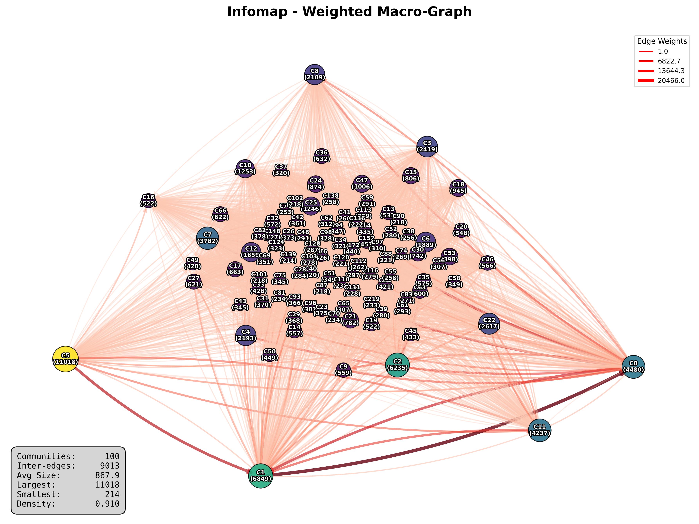
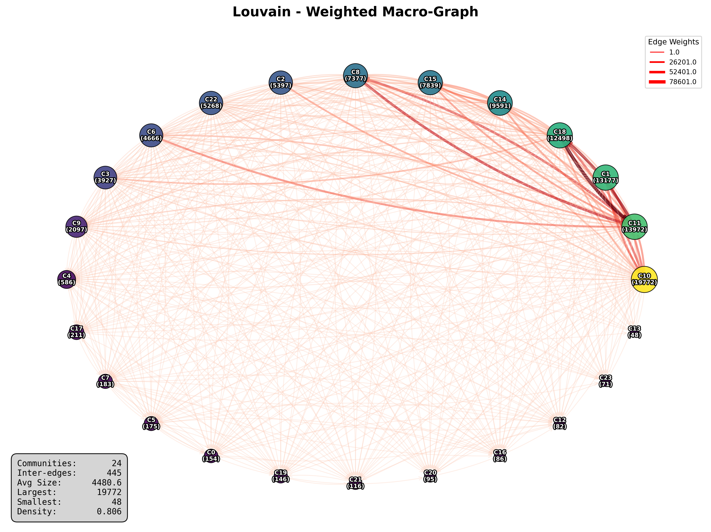
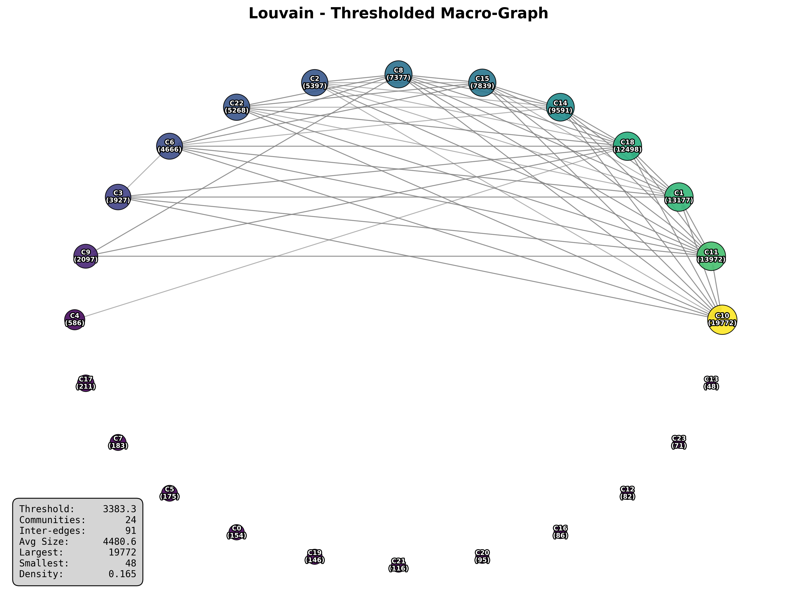
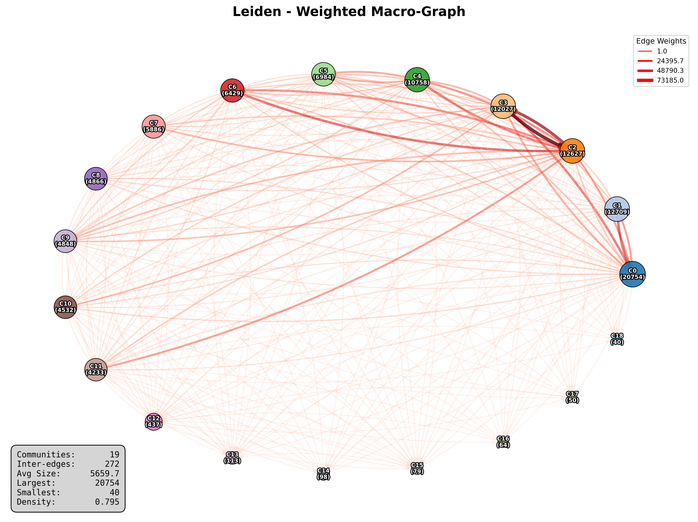
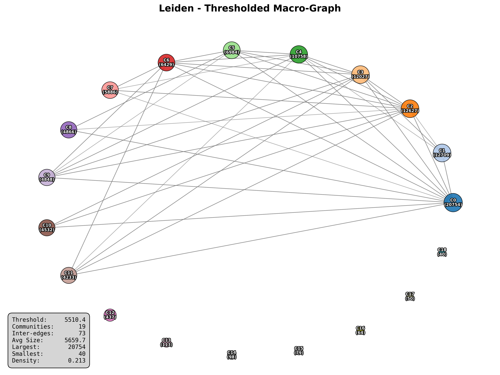
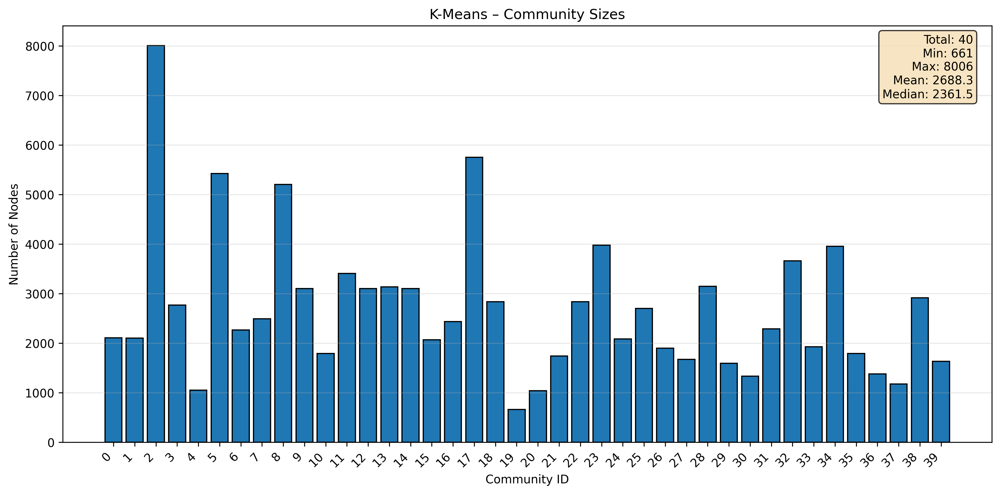
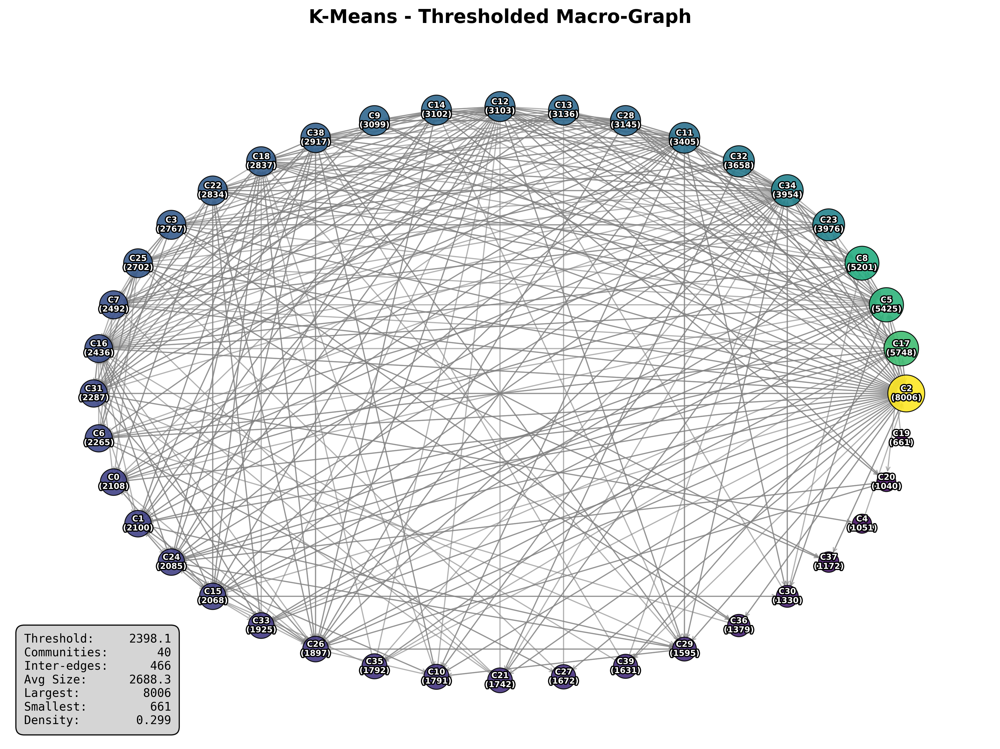

# 📊 Graph Analysis Report

---

## 📋 Analysis Metadata

| Property              | Value                              |
| --------------------- | ---------------------------------- |
| **Run ID**            | `run142`                           |
| **Timestamp**         | 2025-09-29T22:12:42.147466         |
| **Graph Source**      | NQ (Natural Questions) from Google |
| **Analysis Version**  | 3.0                                |
| **Analysis Duration** | 87m 29s                            |

## 🎯 Executive Summary

**Network Overview:**

- **Scale:** Very Large directed network
- **Original Size:** 108,071 nodes, 5,122,983 edges
- **Post-Cleaning Size:** 107,534 nodes, 5,122,982 edges (removed 0.68% of nodes)
- **Connectivity:** sparse (density: 0.04430%)
- **Average Connections:** 95.3 per node

**Key Characteristics:**

- ✅ **Fully Connected:** All nodes are reachable
- 📈 **Growth Potential:** Very sparse network with room for expansion

---

## 📈 Enhanced Data Visualizations

### Comprehensive Degree Analysis

_Four-panel analysis showing linear distribution, log-log scaling for power-law detection, cumulative distribution, and statistical summary via box plot._

---

## 📊 Detailed Metrics

### 🏗️ Graph Structure

_Fundamental properties of the graph topology_

| Metric            | Value     | Status      |
| ----------------- | --------- | ----------- |
| **Is Directed**   | 1         | ✅ computed |
| **Is Weighted**   | 0         | ✅ computed |
| **Is Multigraph** | 0         | ✅ computed |
| **Num Nodes**     | 108,071   | ✅ computed |
| **Num Edges**     | 5,122,983 | ✅ computed |

---

### 🔗 Connectivity Analysis

_Network connectivity and density measurements_

| Metric                      | Value  | Status      |
| --------------------------- | ------ | ----------- |
| **Density**                 | 0.0004 | ✅ computed |
| **Is Connected Undirected** | 1      | ✅ computed |
| **Reciprocity**             | 0.2931 | ✅ computed |
| **Is Strongly Connected**   | 0      | ✅ computed |
| **Is Weakly Connected**     | 1      | ✅ computed |

---

### 🏝️ Node Isolation Analysis

_Statistics about disconnected and removed nodes_

| Metric                                    | Value     | Status      |
| ----------------------------------------- | --------- | ----------- |
| **Num Nodes Zero Total Degree**           | 535       | ✅ computed |
| **Num Isolated Nodes Removed**            | 535       | ✅ computed |
| **Min Component Size Threshold**          | 108       | ✅ computed |
| **Num Small Components Removed**          | 1         | ✅ computed |
| **Num Nodes In Small Components Removed** | 2         | ✅ computed |
| **Total Nodes Removed**                   | 537       | ✅ computed |
| **Num Nodes After Removal**               | 107,534   | ✅ computed |
| **Num Edges After Removal**               | 5,122,982 | ✅ computed |
| **Removal Percentage**                    | 0.68%     | ✅ computed |

---

### 📈 Degree Distribution

_Statistical analysis of node connection patterns_

| Metric             | Value  | Status      |
| ------------------ | ------ | ----------- |
| **Average Degree** | 95.28  | ✅ computed |
| **Max Degree**     | 46,453 | ✅ computed |
| **Min Degree**     | 1      | ✅ computed |
| **Median Degree**  | 46.0   | ✅ computed |
| **Std Dev Degree** | 293.8  | ✅ computed |

---

### ➡️ Directed Graph Properties

_Metrics specific to directed networks (in/out degrees, PageRank)_

| Metric                        | Value  | Status      |
| ----------------------------- | ------ | ----------- |
| **Num Nodes Zero In Degree**  | 11,453 | ✅ computed |
| **Max In Degree**             | 46,388 | ✅ computed |
| **Min In Degree**             | 0      | ✅ computed |
| **Mean In Degree**            | 47.6   | ✅ computed |
| **Median In Degree**          | 14.0   | ✅ computed |
| **Num Nodes Zero Out Degree** | 433    | ✅ computed |
| **Max Out Degree**            | 1,394  | ✅ computed |
| **Min Out Degree**            | 0      | ✅ computed |
| **Mean Out Degree**           | 47.6   | ✅ computed |
| **Median Out Degree**         | 28.0   | ✅ computed |

---

### 🎯 Clustering Analysis

_Local neighborhood connectivity and transitivity_

| Metric                          | Value  | Status      |
| ------------------------------- | ------ | ----------- |
| **Transitivity**                | 0.21   | ✅ computed |
| **Average Clustering**          | 0.2520 | ✅ computed |
| **Filtered Average Clustering** | 0.2541 | ✅ computed |

---

### 📏 Distance & Path Analysis

_Shortest paths and network diameter measurements_

| Metric                                       | Value  | Method                     | Status      |
| -------------------------------------------- | ------ | -------------------------- | ----------- |
| **Largest Scc Diameter**                     | 5      | Aproximation from networkx | ✅ computed |
| **Largest Scc Radius**                       | 2      | 25.0% BFS sampling         | ✅ computed |
| **Largest Scc Average Shortest Path Length** | 2.25   | 25.0% BFS sampling         | ✅ computed |
| **Largest Scc Global Efficiency**            | 0.4593 | 25.0% BFS sampling         | ✅ computed |

---

### ⭐ Node Centrality

_Measures of node importance and influence_

| Metric                        | Value  | Status      |
| ----------------------------- | ------ | ----------- |
| **Average Degree Centrality** | 0.0009 | ✅ computed |

---

### 🧬 Structural Features

_Advanced topological characteristics_

| Metric                   | Value   | Status      |
| ------------------------ | ------- | ----------- |
| **Self Loops**           | 0       | ✅ computed |
| **Degree Assortativity** | -0.0778 | ✅ computed |
| **Max Core Number**      | 230     | ✅ computed |
| **Mean Core Number**     | 42.11   | ✅ computed |

---

### 🧩 Component Analysis

_Connected component structure and distribution_

| Metric                                        | Value                          | Status      |
| --------------------------------------------- | ------------------------------ | ----------- |
| **Num Weakly Connected Components**           | 1                              | ✅ computed |
| **Largest Weakly Connected Component Size**   | 107,534                        | ✅ computed |
| **Weakly Cc Size Mean**                       | 107534.00                      | ✅ computed |
| **Weakly Cc Size Median**                     | 107534.00                      | ✅ computed |
| **Weakly Connected Component Sizes**          | [107534]                       | ✅ computed |
| **Num Strongly Connected Components**         | 12,751                         | ✅ computed |
| **Largest Strongly Connected Component Size** | 94,675                         | ✅ computed |
| **Strongly Cc Size Mean**                     | 8.43                           | ✅ computed |
| **Strongly Cc Size Median**                   | 1.00                           | ✅ computed |
| **Strongly Connected Component Sizes**        | 12751 items (μ=8.43, σ=838.38) | ✅ computed |

---

## 📚 Citation Network Analysis

_Specialized analysis for citation/reference networks_

### Citation Statistics

| Metric      | Citations Made (Out-degree) | Citations Received (In-degree) |
| ----------- | --------------------------- | ------------------------------ |
| **Mean**    | 47.64                       | 47.64                          |
| **Median**  | 28.00                       | 14.00                          |
| **Maximum** | 1394                        | 46388                          |
| **Std Dev** | 59.96                       | 269.58                         |

**Network H-Index:** 657

### Node Categories

- 🏝️ **Isolated Nodes:** 0 (no citations)
- 🔚 **Terminal Nodes:** 433 (don't cite others)
- 🌱 **Source Nodes:** 11453 (not cited by others)

### 🏆 Top 10 Most Cited Papers

| Rank | Node ID | Title                              | Citations |
| ---- | ------- | ---------------------------------- | --------- |
| 1    | `32515` | International Standard Book Number | **46388** |
| 2    | `93432` | Wikipedia, the free encyclopedia   | **46163** |
| 3    | `5115`  | United States                      | **18735** |
| 4    | `63708` | Digital object identifier          | **15092** |
| 5    | `19755` | IMDb                               | **14851** |
| 6    | `10883` | Library of Congress Control Number | **10507** |
| 7    | `8341`  | United Kingdom                     | **10077** |
| 8    | `21518` | The New York Times                 | **8936**  |
| 9    | `17568` | Single (music)                     | **7564**  |
| 10   | `46202` | Geographic coordinate system       | **7536**  |

### 📝 Top 10 Most Citing Papers

| Rank | Node ID | Title                                   | Citations Made |
| ---- | ------- | --------------------------------------- | -------------- |
| 1    | `5115`  | United States                           | **1394**       |
| 2    | `59377` | Timeline of United States history       | **1153**       |
| 3    | `17571` | 2017 in film                            | **998**        |
| 4    | `5565`  | List of performances on Top of the Pops | **998**        |
| 5    | `4831`  | Southern United States                  | **912**        |
| 6    | `5613`  | History of the United States            | **881**        |
| 7    | `14656` | New England                             | **856**        |
| 8    | `22976` | List of Latin phrases (full)            | **843**        |
| 9    | `25737` | California                              | **837**        |
| 10   | `8341`  | United Kingdom                          | **829**        |

### 🌟 Top 10 Most Influential Papers (PageRank)

| Rank | Node ID | Title                              | Influence Score |
| ---- | ------- | ---------------------------------- | --------------- |
| 1    | `32515` | International Standard Book Number | 0.009264        |
| 2    | `93432` | Wikipedia, the free encyclopedia   | 0.006816        |
| 3    | `5115`  | United States                      | 0.003430        |
| 4    | `63708` | Digital object identifier          | 0.003043        |
| 5    | `10883` | Library of Congress Control Number | 0.002761        |
| 6    | `19755` | IMDb                               | 0.002462        |
| 7    | `8341`  | United Kingdom                     | 0.001983        |
| 8    | `10642` | New York City                      | 0.001554        |
| 9    | `21518` | The New York Times                 | 0.001496        |
| 10   | `46202` | Geographic coordinate system       | 0.001375        |

---

# 🏘️ Community Detection Analysis

_Comprehensive analysis of community structures detected by different algorithms_

## 🔍 Algorithm Performance Comparison

### Key Performance Insights

- **🏆 Highest Modularity:** Leiden (0.5993)
- **🔢 Most Communities Found:** Infomap (1249 communities)

### Detailed Performance Metrics

| Algorithm   | Communities | Modularity | Homophily\* | Avg Conductance | Avg TPR | Avg Clustering |
| ----------- | ----------- | ---------- | ----------- | --------------- | ------- | -------------- |
| **Infomap** | 1249        | 0.5054     | 0.5370      | 0.4769          | 0.9189  | 0.4175         |
| **Louvain** | 24          | 0.5967     | 0.7061      | 0.2926          | 0.9593  | 0.3305         |
| **Leiden**  | 19          | 0.5993     | 0.7074      | 0.2908          | 0.9606  | 0.3241         |
| **K-Means** | 40          | 0.2360     | 0.2697      | 0.7459          | 0.6826  | 0.2749         |

## 🔎 Detailed Community Analysis

### Infomap Analysis

#### Community Size Statistics

| Metric                    | Value       |
| ------------------------- | ----------- |
| **Total Communities**     | 1249        |
| **Largest Community**     | 11018 nodes |
| **Smallest Community**    | 1 nodes     |
| **Average Size**          | 86.1 nodes  |
| **Median Size**           | 3.0 nodes   |
| **Singleton Communities** | 443         |

#### Community Size Distribution

_Distribution of community sizes showing the scale and hierarchy of detected communities._

#### Quality Metrics

| Metric              | Value  | Description                                       |
| ------------------- | ------ | ------------------------------------------------- |
| **Modularity**      | 0.5054 | Network division quality (higher = better)        |
| **Homophily**       | 0.5370 | Tendency of similar nodes to cluster              |
| **Avg Conductance** | 0.4769 | Community boundary quality (lower = better)       |
| **Avg TPR**         | 0.9189 | True positive rate for community detection        |
| **Avg Clustering**  | 0.4175 | Average clustering coefficient within communities |

#### Weighted Community Macrograph

_Weighted community interaction network showing connection strengths between communities._

#### Thresholded Community Macrograph

_Simplified community network showing only significant inter-community connections._

#### Top 10 Communities by Size

| Rank | Community ID | Community Name                          | Size    | Keywords                                       |
| ---- | ------------ | --------------------------------------- | ------- | ---------------------------------------------- |
| 1    | **C5**       | **Song, You, Love, Album**              | `11018` | `song, you, love, album, don`                  |
| 2    | **C1**       | **States, United, New, York**           | `6849`  | `states, united, new, york, state`             |
| 3    | **C2**       | **Cell, System, Human, Disease**        | `6235`  | `cell, system, human, disease, muscle`         |
| 4    | **C0**       | **Countries, History, European, World** | `4480`  | `countries, history, european, world, economy` |
| 5    | **C11**      | **Film, Awards, Man, Academy**          | `4237`  | `film, awards, man, academy, series`           |
| 6    | **C7**       | **India, Indian, Pakistan, National**   | `3782`  | `india, indian, pakistan, national, institute` |
| 7    | **C22**      | **Series, Season, Episodes, Show**      | `2617`  | `series, season, episodes, show, characters`   |
| 8    | **C3**       | **Computer, Software, Data, Windows**   | `2419`  | `computer, software, data, windows, system`    |
| 9    | **C4**       | **Church, Catholic, Bible, Biblical**   | `2193`  | `church, catholic, bible, biblical, history`   |
| 10   | **C8**       | **United, Kingdom, England, London**    | `2109`  | `united, kingdom, england, london, british`    |

### Louvain Analysis

#### Community Size Statistics

| Metric                    | Value        |
| ------------------------- | ------------ |
| **Total Communities**     | 24           |
| **Largest Community**     | 19772 nodes  |
| **Smallest Community**    | 48 nodes     |
| **Average Size**          | 4480.6 nodes |
| **Median Size**           | 1341.5 nodes |
| **Singleton Communities** | 0            |

#### Community Size Distribution

_Distribution of community sizes showing the scale and hierarchy of detected communities._

#### Quality Metrics

| Metric              | Value  | Description                                       |
| ------------------- | ------ | ------------------------------------------------- |
| **Modularity**      | 0.5967 | Network division quality (higher = better)        |
| **Homophily**       | 0.7061 | Tendency of similar nodes to cluster              |
| **Avg Conductance** | 0.2926 | Community boundary quality (lower = better)       |
| **Avg TPR**         | 0.9593 | True positive rate for community detection        |
| **Avg Clustering**  | 0.3305 | Average clustering coefficient within communities |

#### Weighted Community Macrograph

_Weighted community interaction network showing connection strengths between communities._

#### Thresholded Community Macrograph

_Simplified community network showing only significant inter-community connections._

#### Top 10 Communities by Size

| Rank | Community ID | Community Name                          | Size    | Keywords                                     |
| ---- | ------------ | --------------------------------------- | ------- | -------------------------------------------- |
| 1    | **C10**      | **Film, Series, Season, Episodes**      | `19772` | `film, series, season, episodes, characters` |
| 2    | **C11**      | **World, War, South, History**          | `13972` | `world, war, south, history, canada`         |
| 3    | **C1**       | **Song, You, Love, Album**              | `13177` | `song, you, love, album, music`              |
| 4    | **C18**      | **States, United, New, State**          | `12498` | `states, united, new, state, act`            |
| 5    | **C14**      | **Cell, History, Cuisine, System**      | `9591`  | `cell, history, cuisine, system, human`      |
| 6    | **C15**      | **Power, Energy, System, History**      | `7839`  | `power, energy, system, history, water`      |
| 7    | **C8**       | **History, Church, Roman, Ancient**     | `7377`  | `history, church, roman, ancient, theory`    |
| 8    | **C2**       | **India, Indian, Cricket, National**    | `5397`  | `india, indian, cricket, national, pakistan` |
| 9    | **C22**      | **Episodes, Computer, Video, Software** | `5268`  | `episodes, computer, video, software, game`  |
| 10   | **C6**       | **Cup, Surname, United, World**         | `4666`  | `cup, surname, united, world, football`      |

### Leiden Analysis

#### Community Size Statistics

| Metric                    | Value        |
| ------------------------- | ------------ |
| **Total Communities**     | 19           |
| **Largest Community**     | 20754 nodes  |
| **Smallest Community**    | 40 nodes     |
| **Average Size**          | 5659.7 nodes |
| **Median Size**           | 4848.0 nodes |
| **Singleton Communities** | 0            |

#### Community Size Distribution

_Distribution of community sizes showing the scale and hierarchy of detected communities._

#### Quality Metrics

| Metric              | Value  | Description                                       |
| ------------------- | ------ | ------------------------------------------------- |
| **Modularity**      | 0.5993 | Network division quality (higher = better)        |
| **Homophily**       | 0.7074 | Tendency of similar nodes to cluster              |
| **Avg Conductance** | 0.2908 | Community boundary quality (lower = better)       |
| **Avg TPR**         | 0.9606 | True positive rate for community detection        |
| **Avg Clustering**  | 0.3241 | Average clustering coefficient within communities |

#### Weighted Community Macrograph

_Weighted community interaction network showing connection strengths between communities._

#### Thresholded Community Macrograph

_Simplified community network showing only significant inter-community connections._

#### Top 10 Communities by Size

| Rank | Community ID | Community Name                       | Size    | Keywords                                     |
| ---- | ------------ | ------------------------------------ | ------- | -------------------------------------------- |
| 1    | **C0**       | **Film, Series, Season, Episodes**   | `20754` | `film, series, season, episodes, characters` |
| 2    | **C1**       | **Song, You, Love, Album**           | `12709` | `song, you, love, album, music`              |
| 3    | **C2**       | **World, War, South, United**        | `12627` | `world, war, south, united, history`         |
| 4    | **C3**       | **States, United, New, State**       | `12027` | `states, united, new, state, act`            |
| 5    | **C4**       | **Cell, History, Human, Cuisine**    | `10758` | `cell, history, human, cuisine, system`      |
| 6    | **C5**       | **Power, System, Energy, Engine**    | `6984`  | `power, system, energy, engine, history`     |
| 7    | **C6**       | **History, Church, Roman, Ancient**  | `6429`  | `history, church, roman, ancient, art`       |
| 8    | **C7**       | **India, Indian, Cricket, National** | `5886`  | `india, indian, cricket, national, pakistan` |
| 9    | **C8**       | **Episodes, Computer, Video, Game**  | `4866`  | `episodes, computer, video, game, software`  |
| 10   | **C9**       | **Law, Theory, Social, Management**  | `4848`  | `law, theory, social, management, analysis`  |

### K-Means Analysis

#### Community Size Statistics

| Metric                    | Value        |
| ------------------------- | ------------ |
| **Total Communities**     | 40           |
| **Largest Community**     | 8006 nodes   |
| **Smallest Community**    | 661 nodes    |
| **Average Size**          | 2688.3 nodes |
| **Median Size**           | 2361.5 nodes |
| **Singleton Communities** | 0            |

#### Community Size Distribution

_Distribution of community sizes showing the scale and hierarchy of detected communities._

#### Quality Metrics

| Metric              | Value  | Description                                       |
| ------------------- | ------ | ------------------------------------------------- |
| **Modularity**      | 0.2360 | Network division quality (higher = better)        |
| **Homophily**       | 0.2697 | Tendency of similar nodes to cluster              |
| **Avg Conductance** | 0.7459 | Community boundary quality (lower = better)       |
| **Avg TPR**         | 0.6826 | True positive rate for community detection        |
| **Avg Clustering**  | 0.2749 | Average clustering coefficient within communities |

#### Weighted Community Macrograph

_Weighted community interaction network showing connection strengths between communities._

#### Thresholded Community Macrograph

_Simplified community network showing only significant inter-community connections._

#### Top 10 Communities by Size

| Rank | Community ID | Community Name                       | Size   | Keywords                                    |
| ---- | ------------ | ------------------------------------ | ------ | ------------------------------------------- |
| 1    | **C2**       | **Surname, John, Actor, Michael**    | `8006` | `surname, john, actor, michael, david`      |
| 2    | **C17**      | **Football, Cup, World, League**     | `5748` | `football, cup, world, league, national`    |
| 3    | **C5**       | **System, Computer, Data, Software** | `5425` | `system, computer, data, software, network` |
| 4    | **C8**       | **Cell, Acid, System, Blood**        | `5201` | `cell, acid, system, blood, muscle`         |
| 5    | **C23**      | **You, Love, Don, Your**             | `3976` | `you, love, don, your, all`                 |
| 6    | **C34**      | **River, California, Florida, Lake** | `3954` | `river, california, florida, lake, new`     |
| 7    | **C32**      | **Song, Album, You, Love**           | `3658` | `song, album, you, love, songs`             |
| 8    | **C11**      | **New, City, York, Park**            | `3405` | `new, city, york, park, station`            |
| 9    | **C28**      | **Surname, Name, Latin, Del**        | `3145` | `surname, name, latin, del, french`         |
| 10   | **C13**      | **Name, Season, Mary, Sarah**        | `3136` | `name, season, mary, sarah, given`          |

## 💡 Summary Insights

### Algorithm Selection Guide

- 🏆 **Infomap:** High-quality community structure detected
- 🏆 **Louvain:** High-quality community structure detected
- 🏆 **Leiden:** High-quality community structure detected
- 🔍 **K-Means:** Good for finding fine-grained communities

### Key Findings

- **Consistency:** Tested 4 algorithms with average modularity of 0.4844 (±0.1483)
- **Variation:** Community counts range from 19 to 1249
- **Quality:** 3 algorithm(s) achieved high modularity (>0.3): Infomap, Louvain, Leiden

---

_Community analysis completed. Report generated automatically by the community detection pipeline._
