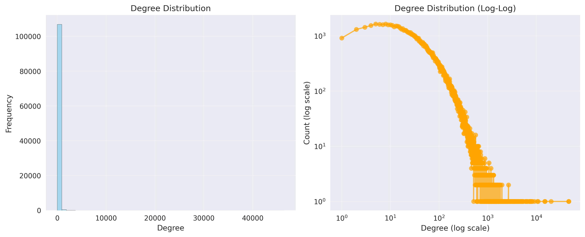
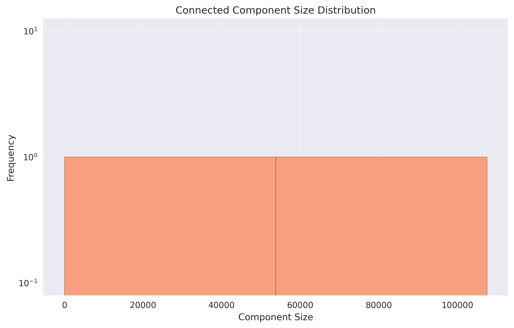

# 📊 Graph Analysis Report

---

## 📋 Analysis Metadata

| Property             | Value                              |
| -------------------- | ---------------------------------- |
| **Run ID**           | `run85`                            |
| **Timestamp**        | 2025-09-23T02:06:32.809335         |
| **Graph Source**     | NQ (Natural Questions) from Google |
| **Analysis Version** | 3.0                                |

### ⏱️ Performance Summary

- **Total Computation Time:** 0.00 seconds
- **Metrics Computed:** 14

---

## 🎯 Executive Summary

**Network Overview:**

- **Scale:** Very Large directed network
- **Size:** 108,071 nodes, 5,122,983 edges
- **Connectivity:** sparse (density: 0.0%)
- **Average Connections:** 95.3 per node

**Key Characteristics:**

- 📈 **Growth Potential:** Very sparse network with room for expansion

---

## 📈 Data Visualizations

### Degree Distribution

**Degree Distribution Sparkline:** `█                                                `

### Component Size Distribution

---

## 📊 Detailed Metrics

### 🏗️ Graph Structure

_Fundamental properties of the graph topology_

| Metric            | Value     | Status      |
| ----------------- | --------- | ----------- |
| **Is Directed**   | 1         | ✅ computed |
| **Is Weighted**   | 0         | ✅ computed |
| **Is Multigraph** | 0         | ✅ computed |
| **Num Nodes**     | 108,071   | ✅ computed |
| **Num Edges**     | 5,122,983 | ✅ computed |

---

### 🔗 Connectivity Analysis

_Network connectivity and density measurements_

| Metric                      | Value  | Status      |
| --------------------------- | ------ | ----------- |
| **Density**                 | 0.0004 | ✅ computed |
| **Is Connected Undirected** | 0      | ✅ computed |
| **Reciprocity**             | 0.2931 | ✅ computed |
| **Is Strongly Connected**   | 0      | ✅ computed |
| **Is Weakly Connected**     | 0      | ✅ computed |

---

### 🏝️ Node Isolation Analysis

_Statistics about disconnected and removed nodes_

| Metric                          | Value     | Status      |
| ------------------------------- | --------- | ----------- |
| **Num Nodes Zero Total Degree** | 535       | ✅ computed |
| **Num Isolated Nodes Removed**  | 535       | ✅ computed |
| **Num Nodes After Removal**     | 107,536   | ✅ computed |
| **Num Edges After Removal**     | 5,122,983 | ✅ computed |

---

### 📈 Degree Distribution

_Statistical analysis of node connection patterns_

| Metric             | Value  | Status      |
| ------------------ | ------ | ----------- |
| **Average Degree** | 95.28  | ✅ computed |
| **Max Degree**     | 46,453 | ✅ computed |
| **Min Degree**     | 1      | ✅ computed |
| **Median Degree**  | 46.0   | ✅ computed |
| **Std Dev Degree** | 293.8  | ✅ computed |

---

### ➡️ Directed Graph Properties

_Metrics specific to directed networks (in/out degrees, PageRank)_

| Metric                        | Value  | Status      |
| ----------------------------- | ------ | ----------- |
| **Num Nodes Zero In Degree**  | 11,454 | ✅ computed |
| **Max In Degree**             | 46,388 | ✅ computed |
| **Min In Degree**             | 0      | ✅ computed |
| **Mean In Degree**            | 47.6   | ✅ computed |
| **Median In Degree**          | 14.0   | ✅ computed |
| **Num Nodes Zero Out Degree** | 434    | ✅ computed |
| **Max Out Degree**            | 1,394  | ✅ computed |
| **Min Out Degree**            | 0      | ✅ computed |
| **Mean Out Degree**           | 47.6   | ✅ computed |
| **Median Out Degree**         | 28.0   | ✅ computed |

---

### 🎯 Clustering Analysis

_Local neighborhood connectivity and transitivity_

| Metric                          | Value  | Status      |
| ------------------------------- | ------ | ----------- |
| **Transitivity**                | 0.21   | ✅ computed |
| **Average Clustering**          | 0.2519 | ✅ computed |
| **Filtered Average Clustering** | 0.2541 | ✅ computed |

---

### 📏 Distance & Path Analysis

_Shortest paths and network diameter measurements_

| Metric                                       | Value  | Method                | Status      |
| -------------------------------------------- | ------ | --------------------- | ----------- |
| **Largest Scc Diameter**                     | 5      | 2-sweep approximation | ✅ computed |
| **Largest Scc Radius**                       | 4      | sampling (100 pairs)  | ✅ computed |
| **Largest Scc Average Shortest Path Length** | 2.57   | sampling (1000 pairs) | ✅ computed |
| **Largest Scc Global Efficiency**            | 0.4012 | sampling (1000 pairs) | ✅ computed |

---

### ⭐ Node Centrality

_Measures of node importance and influence_

| Metric                        | Value  | Status      |
| ----------------------------- | ------ | ----------- |
| **Average Degree Centrality** | 0.0009 | ✅ computed |

---

### 🧬 Structural Features

_Advanced topological characteristics_

| Metric                   | Value   | Status      |
| ------------------------ | ------- | ----------- |
| **Self Loops**           | 0       | ✅ computed |
| **Degree Assortativity** | -0.0778 | ✅ computed |
| **Max Core Number**      | 230     | ✅ computed |
| **Mean Core Number**     | 42.11   | ✅ computed |

---

### 🧩 Component Analysis

_Connected component structure and distribution_

| Metric                                        | Value                          | Status      |
| --------------------------------------------- | ------------------------------ | ----------- |
| **Num Weakly Connected Components**           | 2                              | ✅ computed |
| **Largest Weakly Connected Component Size**   | 107,534                        | ✅ computed |
| **Weakly Cc Size Mean**                       | 53768.00                       | ✅ computed |
| **Weakly Cc Size Median**                     | 53768.00                       | ✅ computed |
| **Weakly Connected Component Sizes**          | [107534, 2]                    | ✅ computed |
| **Num Strongly Connected Components**         | 12,753                         | ✅ computed |
| **Largest Strongly Connected Component Size** | 94,675                         | ✅ computed |
| **Strongly Cc Size Mean**                     | 8.43                           | ✅ computed |
| **Strongly Cc Size Median**                   | 1.00                           | ✅ computed |
| **Strongly Connected Component Sizes**        | 12753 items (μ=8.43, σ=838.32) | ✅ computed |

---

## 📚 Citation Network Analysis

_Specialized analysis for citation/reference networks_

### Citation Statistics

| Metric      | Citations Made (Out-degree) | Citations Received (In-degree) |
| ----------- | --------------------------- | ------------------------------ |
| **Mean**    | 47.64                       | 47.64                          |
| **Median**  | 28.00                       | 14.00                          |
| **Maximum** | 1394                        | 46388                          |
| **Std Dev** | 59.96                       | 269.57                         |

**Network H-Index:** 657

### Node Categories

- 🏝️ **Isolated Nodes:** 0 (no citations)
- 🔚 **Terminal Nodes:** 434 (don't cite others)
- 🌱 **Source Nodes:** 11454 (not cited by others)

### 🏆 Top 10 Most Cited Papers

| Rank | Node ID | Title                              | Citations |
| ---- | ------- | ---------------------------------- | --------- |
| 1    | `32515` | International Standard Book Number | **46388** |
| 2    | `93432` | Wikipedia, the free encyclopedia   | **46163** |
| 3    | `5115`  | United States                      | **18735** |
| 4    | `63708` | Digital object identifier          | **15092** |
| 5    | `19755` | IMDb                               | **14851** |
| 6    | `10883` | Library of Congress Control Number | **10507** |
| 7    | `8341`  | United Kingdom                     | **10077** |
| 8    | `21518` | The New York Times                 | **8936**  |
| 9    | `17568` | Single (music)                     | **7564**  |
| 10   | `46202` | Geographic coordinate system       | **7536**  |

### 📝 Top 10 Most Citing Papers

| Rank | Node ID | Title                                   | Citations Made |
| ---- | ------- | --------------------------------------- | -------------- |
| 1    | `5115`  | United States                           | **1394**       |
| 2    | `59377` | Timeline of United States history       | **1153**       |
| 3    | `17571` | 2017 in film                            | **998**        |
| 4    | `5565`  | List of performances on Top of the Pops | **998**        |
| 5    | `4831`  | Southern United States                  | **912**        |
| 6    | `5613`  | History of the United States            | **881**        |
| 7    | `14656` | New England                             | **856**        |
| 8    | `22976` | List of Latin phrases (full)            | **843**        |
| 9    | `25737` | California                              | **837**        |
| 10   | `8341`  | United Kingdom                          | **829**        |

### 🌟 Top 10 Most Influential Papers (PageRank)

| Rank | Node ID | Title                              | Influence Score |
| ---- | ------- | ---------------------------------- | --------------- |
| 1    | `32515` | International Standard Book Number | 0.009264        |
| 2    | `93432` | Wikipedia, the free encyclopedia   | 0.006816        |
| 3    | `5115`  | United States                      | 0.003430        |
| 4    | `63708` | Digital object identifier          | 0.003043        |
| 5    | `10883` | Library of Congress Control Number | 0.002761        |
| 6    | `19755` | IMDb                               | 0.002462        |
| 7    | `8341`  | United Kingdom                     | 0.001983        |
| 8    | `10642` | New York City                      | 0.001554        |
| 9    | `21518` | The New York Times                 | 0.001496        |
| 10   | `46202` | Geographic coordinate system       | 0.001375        |
